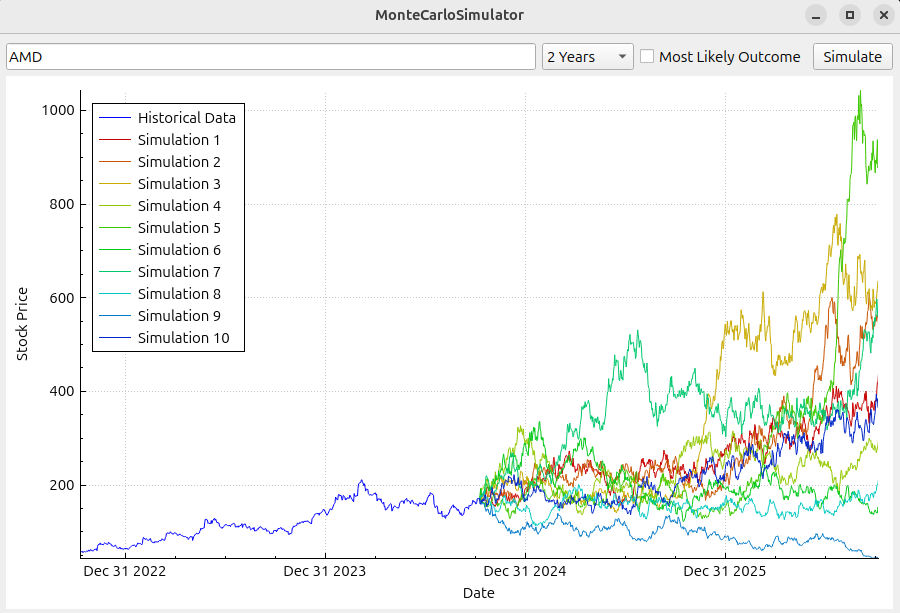
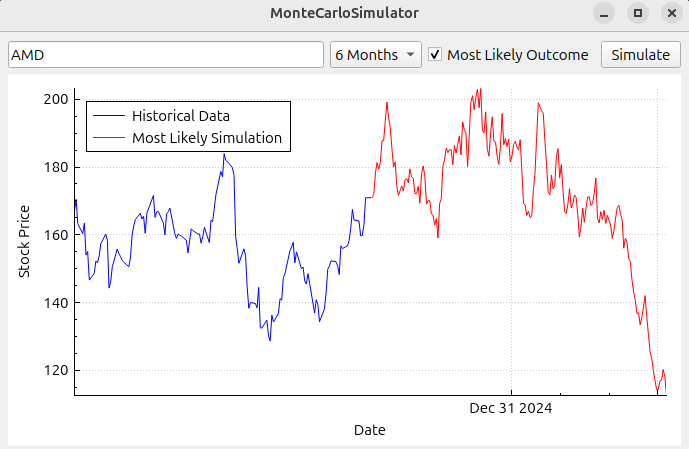

# Monte Carlo Stock Simulator

## Overview

The Monte Carlo Stock Simulator is a C++ application that performs Monte Carlo simulations on stock prices to predict future stock performance. It leverages historical stock data fetched using Python's `yfinance` library and provides an interactive graphical interface using Qt and QCustomPlot. The application allows users to:

- Enter a stock ticker symbol.
- Select a historical data period (1 Month, 6 Months, 1 Year, 2 Years).
- Choose whether to simulate the most likely outcome.
- View the historical stock data and simulation results on an interactive graph.



## Table of Contents

- [Overview](#overview)
- [Features](#features)
- [Prerequisites](#prerequisites)
- [Installation](#installation)
  - [1. Clone the Repository](#1-clone-the-repository)
  - [2. Set Up Python Environment](#2-set-up-python-environment)
  - [3. Build the Application](#3-build-the-application)
- [Usage](#usage)
  - [Using the Application](#using-the-application)
  - [Example](#example)
- [Technical Details](#technical-details)
  - [Overview](#overview-1)
  - [Monte Carlo Simulation Details](#monte-carlo-simulation-details)
  - [Data Management](#data-management)
  - [User Interface](#user-interface)

## Features

- **Interactive Graph**: Zoom, pan, and hover over data points to see exact dates and prices.
- **Multiple Simulation Periods**: Choose from 1 Month, 6 Months, 1 Year, or 2 Years for both historical data and simulation.
- **Most Likely Outcome**: Option to simulate the most likely stock price trajectory.
- **Historical Data Display**: View full historical data when zooming out, beyond the initially selected period.

## Prerequisites

- **C++ Compiler**: Supports C++11 or later.
- **Qt Framework**: Version 5 or later.
- **QCustomPlot**: Qt C++ widget for plotting and data visualization.
- **Python**: Version 3.x.
- **Python Packages**:
  - `yfinance`: For fetching historical stock data.
  - `pandas` (dependency of `yfinance`).

## Installation

### 1. Clone the Repository

```bash
git clone https://github.com/keithhb33/MonteCarloStockSimulator.git
cd MonteCarloStockSimulator
```

### 2. Set Up Python Environment

It is recommended to use a virtual environment:

```bash
python3 -m venv venv
source venv/bin/activate
pip install -r requirements.txt
```

### 3. Build the application

A compile.sh script is provided to automate the build process. The script contains the following commands:

```bash
rm -rf build
mkdir build
cp fetch_data.py build/fetch_data.py
cd build
cmake ..
make
```

To compile and run the program:
```bash
chmod +x compile.sh
./compile.sh
```

After building, navigate to the build directory and run the executable:
```bash
cd build
./MonteCarloSimulation
```

Or run:
```bash
./start.sh
```


## Usage

### Using the Application

1. **Enter Stock Ticker**: In the input field, type the ticker symbol of the stock (e.g., `AAPL` for Apple Inc.).
2. **Select Period**: Choose the desired historical data and simulation period from the dropdown menu (`1 Month`, `6 Months`, `1 Year`, `2 Years`).
3. **Most Likely Outcome**: Check the box if you want the simulation to reflect the most likely outcome without random shocks.
4. **Simulate**: Click the `Simulate` button to fetch data and run the simulation.
5. **Interactive Graph**:
   - **Zoom**: Use the mouse wheel to zoom in and out.
   - **Pan**: Click and drag to move around the graph.

### Example
<p align="center">
  
</p>

## Technical Details

### Overview

The application combines C++ and Python to fetch data, perform simulations, and display results. Here's how it works:

1. **Data Fetching**: A Python script (`fetch_data.py`) uses the `yfinance` library to download historical stock data and saves it as a CSV file.
2. **Data Parsing**: The C++ application reads the CSV file, parses dates and closing prices, and stores the data.
3. **Monte Carlo Simulation**: The `MonteCarlo` class in C++ calculates the drift and volatility from historical prices and runs the simulation over the selected period.
4. **Graphical Display**: Using Qt and QCustomPlot, the application displays the historical data and simulation results on an interactive graph.

### Monte Carlo Simulation Details

- **Drift Calculation**: The drift is calculated using the mean of the logarithmic returns adjusted by half the variance.
- **Volatility Calculation**: The volatility is the standard deviation of the logarithmic returns.
- **Simulation**: The future prices are simulated using the geometric Brownian motion formula:
  
  S_t = S_{t-1} × e^{(drift + volatility × ε)}

  where ε is a random shock from a normal distribution (set to 0 if "Most Likely Outcome" is selected).

### Data Management

- **Fetching Maximum Data**: The application fetches the maximum available historical data to allow users to zoom out and see more data.
- **Initial Display**: Only data corresponding to the selected period is displayed initially.
- **Data Storage**: All data is stored in memory to enable interactive features like zooming and panning.

### User Interface

- **Qt Widgets**: The UI is built using Qt widgets, including `QLineEdit`, `QComboBox`, `QCheckBox`, and `QPushButton`.
- **Custom Plotting**: QCustomPlot is used for plotting the graph, handling interactions, and displaying tooltips.
- **Interactivity**: The graph supports mouse interactions for zooming, panning, and hovering over data points.

### Disclaimer

Disclaimer: This application is intended for educational purposes and should not be used for actual financial decision-making. Stock market investments carry risks, and predictions made by simulations are not guarantees of future performance.


